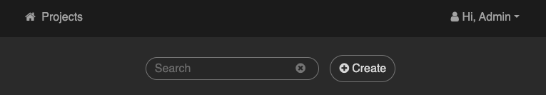
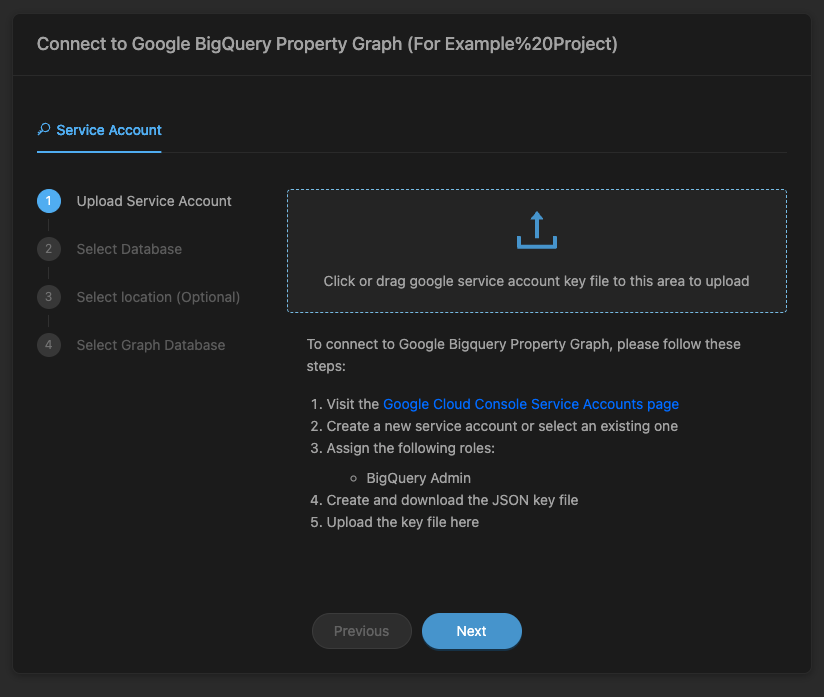
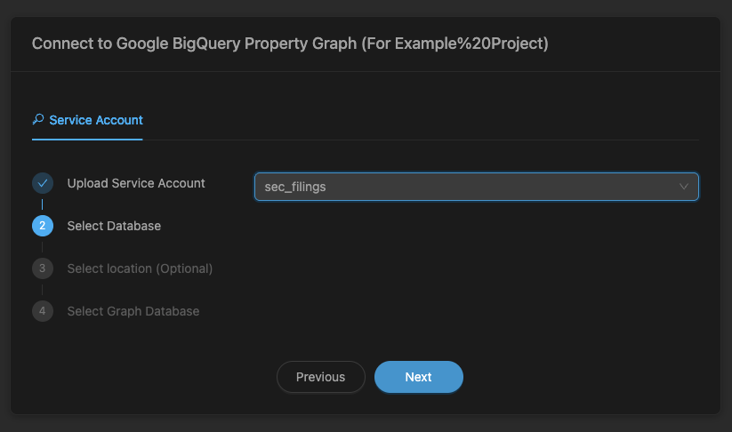
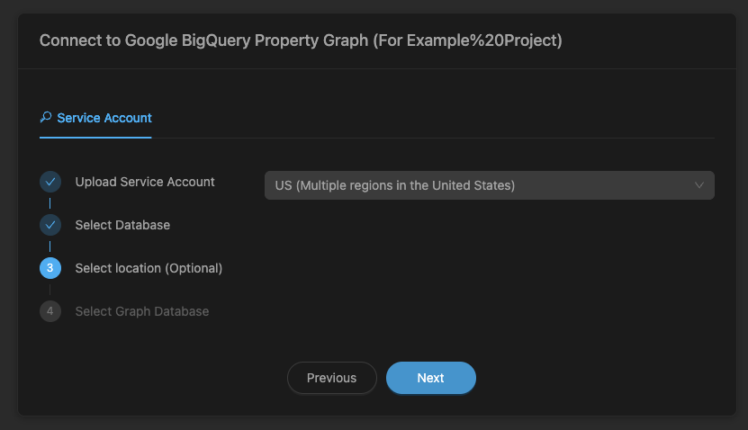
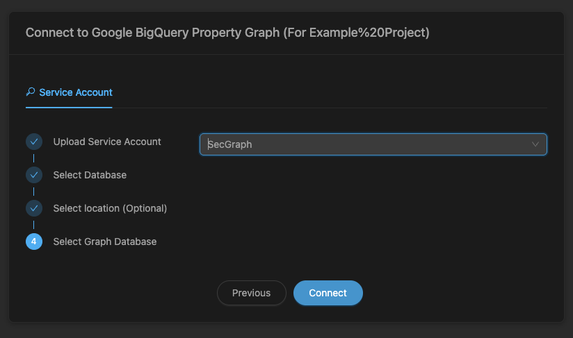

# Fortune 500 SEC Filings Pipeline (Custom Edition)

A high-performance, custom-built Python scraper to download 10-K and 10-Q filings for Fortune 500 companies from the SEC EDGAR database, combined with a robust workflow that transforms this massive unstructured text directly into a queried Property Graph in Google BigQuery utilizing Vertex AI (Gemini 3.1Pro) for dynamic entity extraction. 


## Features

- **Custom Python Backing**: Scrapes SEC "Classic Browse" directly with `asyncio`.
- **Top Tier Performance**: Concurrent downloading, handling resolution and strictly compliant with SEC limiting protocols. 
- **Flexible Extractor Configurations**: Parse exact years, CIK, Tickers, and automatically skip files via checkpointing.
- **AI Powered Synthesis**: Extracts exact insights (Markets, Risks, Competitions) organically into JSON structures natively inside BigQuery using `AI.GENERATE_TEXT`.
- **Intelligent Graph Creation**: Builds node and edge tables in BigQuery from extracted JSON (including LLM-based normalization in SQL), then materializes a Property Graph for visualization.

## Usage

### 🛑 Before You Begin

Before executing the data pipeline, you must configure your Google Cloud Platform (GCP) environment. 

1. **Create a Google Cloud Project:** Head over to the [Google Cloud Console](https://console.cloud.google.com/) and create a new project. You will need your **project ID** to connect the notebook.
2. **Enable Required APIs:** Enable both the [BigQuery API](https://console.cloud.google.com/marketplace/product/google/bigquery.googleapis.com) and the [Vertex AI API](https://console.cloud.google.com/marketplace/product/google/aiplatform.googleapis.com) for your newly created project. You will need them to query and use the Gemini LLM.
3. **Enable Billing:** Ensure that **[Billing is Enabled](https://console.cloud.google.com/billing/enable)** for your project. BigQuery AI functions (Gemini) require an active billing account to execute. *Note: If you have just enabled billing, it can take 3–10 minutes to propagate across all Vertex AI and BigQuery services.*
4. **Create a BigQuery AI Connection:** To use the Gemini model, create a Cloud Resource Connection named **`vertex_ai_connection`** in the **US** (or your preferred) location. Grant the resulting Service Account the **`roles/aiplatform.user`** (Vertex AI User) role.
5. **Create a Cloud Storage Bucket:** Use **Cloud Storage** to create a new bucket (e.g., `gs://your-project-sec-data`). This is used for staging JSON extraction data before loading it into the BigQuery graph.

### Recommended Method: Colab Notebook

[](https://colab.research.google.com/github/Kineviz/fortune500/blob/main/pipeline.ipynb)

### Command line

Run from the repo root. The full pipeline uses `python3` (same as `00_run_full_pipeline.sh`).

**Full pipeline — `00_run_full_pipeline.sh`**

```bash
./00_run_full_pipeline.sh
./00_run_full_pipeline.sh AAPL
./00_run_full_pipeline.sh GOOGL,AAPL
```

Optional: `GCP_PROJECT`, `BQ_DATASET`, `GCS_BUCKET`, `GEMINI_MODEL` (defaults are in the script). `FORCE_FULL_INSIGHTS_REFRESH=1` drops and rebuilds `insights`; otherwise extraction only fills gaps.

Flow: scrape → parse → sections JSONL → GCS → BigQuery → insights → graph tables → property graph DDL. Details: the script and `pipeline.ipynb`.

Example GQL (replace `sec_filings` with your dataset if different):

```sql
GRAPH sec_filings.SecGraph
MATCH (c:Company)-[:ENTERING]->(m:Market)
WHERE m.year = 2020
RETURN c.id, m.id, m.evidence
```

**Piecemeal scripts**

| Step | Script | Typical use |
|------|--------|-------------|
| 1 | `01_scraper.py` | Download filings → `data/sgml/.../full-submission.txt` |
| 2 | `02_parser.py` | SGML → markdown under `data/markdown/` |
| 3 | `03_extract_sections.py` | Sections → `data/json/<ticker>/<year>/sections.jsonl` |

```bash
python3 01_scraper.py --limit 10 --output-dir data/sgml
python3 01_scraper.py --ticker AAPL --year 2024 --output-dir data/sgml
python3 02_parser.py
python3 03_extract_sections.py
python3 03_extract_sections.py --ticker AAPL --year 2023
```

`01_scraper.py` defaults `--output-dir` to `test`; use `data/sgml` to match the full pipeline. Each script accepts `--help` for full flags.

**Data layout**

```
data/sgml/<Ticker>/<10-K|10-Q>/<accession>/full-submission.txt
data/json/<Ticker>/<year>/sections.jsonl
```

## Visualizing with GraphXR

  

You have two main options for visualizing your graph, depending on your data privacy and deployment needs.

### Alternative 1: GraphXR Explorer for BigQuery (Privacy-First)

If you need to avoid sending sensitive data to Kineviz servers and want the application to run entirely inside your own Google Cloud environment, you can deploy the native BigQuery integration directly from the marketplace.

👉 **[Deploy GraphXR Explorer For BigQuery from Google Marketplace](https://console.cloud.google.com/marketplace/product/kineviz-public/graphxr-explorer-for-bigquery?project=kineviz-bigquery-graph)**

### Alternative 2: Standard GraphXR Portal

Once your property graph is configured natively inside BigQuery, you can also connect directly to the dataset using the standard GraphXR web portal (**[https://graphxr.kineviz.com/](https://graphxr.kineviz.com/)**) with the following configuration sequence:

1. **Create Project**

   

2. **Select Name & Database Type (BigQuery)**
   
   

3. **Upload Account Key**
   
   

4. **Select Database**
   
   

5. **Select Region**
   
   

6. **Select Graph**
   
   

## License
[MIT](https://choosealicense.com/licenses/mit/)